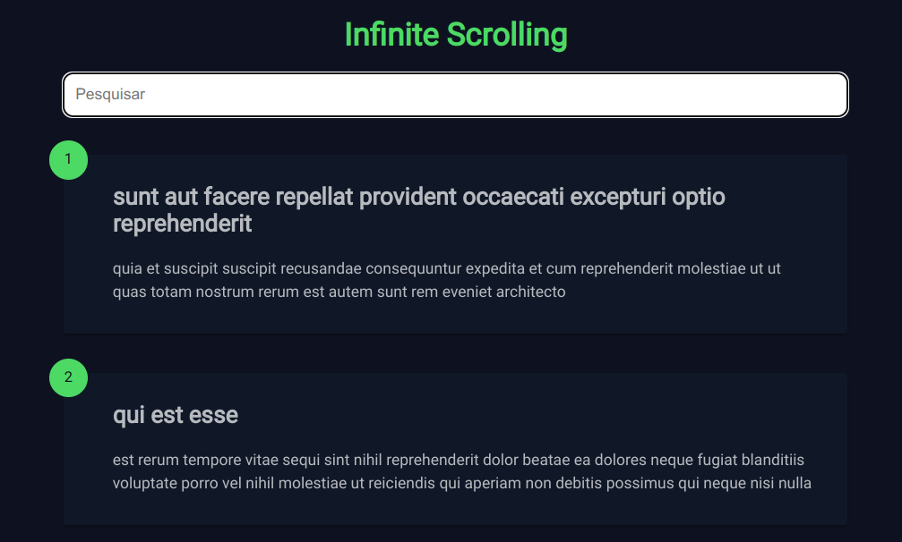

<h1 align="center"> Infinite-Scrolling </h1>

Aula do Roger Melo no <a href="https://www.youtube.com/watch?v=NnjDJt68uLs&list=PLpSJMw6H4PFMOJHMULTxKNOEw7g1cBuyP&index=8" target="_blank">Youtube</a>

  <a href="#-tecnologias">Tecnologias</a>&nbsp;&nbsp;&nbsp;|&nbsp;&nbsp;&nbsp;
  <a href="#-projeto">Projeto</a>&nbsp;&nbsp;&nbsp;|&nbsp;&nbsp;&nbsp;
  <a href="#-layout">Layout</a>&nbsp;&nbsp;&nbsp;|&nbsp;&nbsp;&nbsp;
  <a href="#memo-licença">Licença</a>

  

 

  

## 🚀 Tecnologias

Esse projeto foi desenvolvido com as seguintes tecnologias:

-   HTML e CSS
-   JavaScript e JSON

## 💻 Projeto

Aplicação JavaScript: Como desenvolver uma filtragem de posts e scroll infinito

## 🔖 Demo

    Você pode visualizar a demo do projeto através <a href="https://infinite-scrolling-sooty.vercel.app/" target="_blank">DESSE LINK.</a>

## :memo: Licença

Esse projeto está sob a licença MIT.
